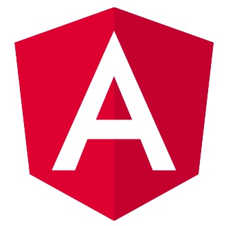
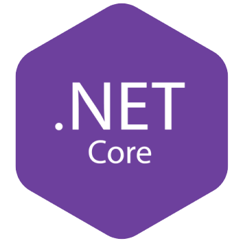

## Code Pulse

### 
 Angular

### 
 .NET Web API

## Purpose
This project is aimed at demonstrating a blog application that an admin can create new blogs, toggle visibility, create categories, and more. This allows admins to create new blogs with relatively little code. 

Admin can create a new blog using Markdown language. This application will then convert the markdown to css and HTML.

## Further Implementation
An future implementation that would be ideal for larger scale blogs would be to add a photo storage API connection to store image in the cloud.

### Default administrator information 

Email: admin@codepulse.com
Password: Admin@123

** This can be changed in The API AuthDbContext. **

